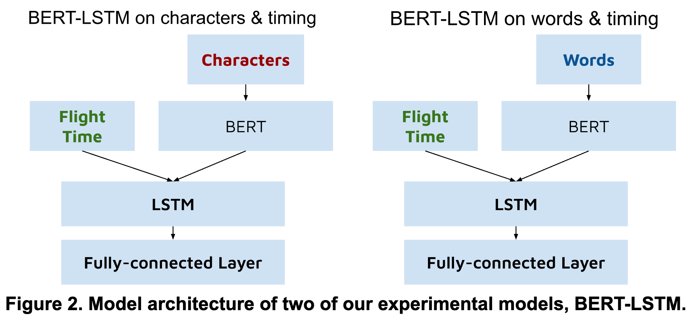
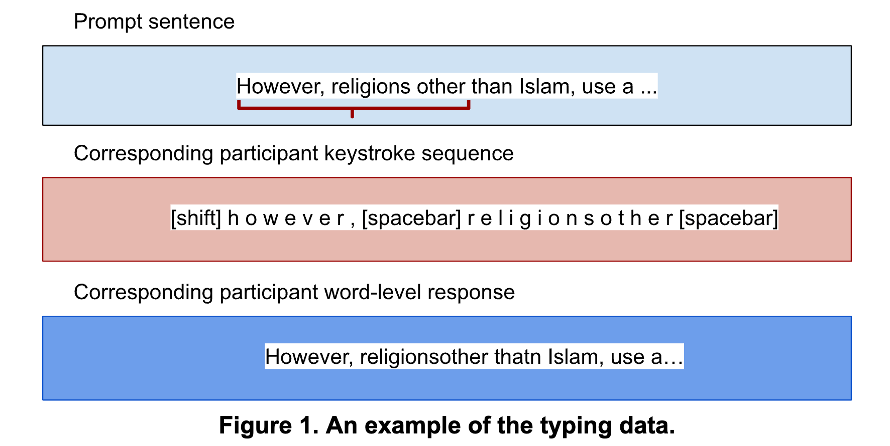
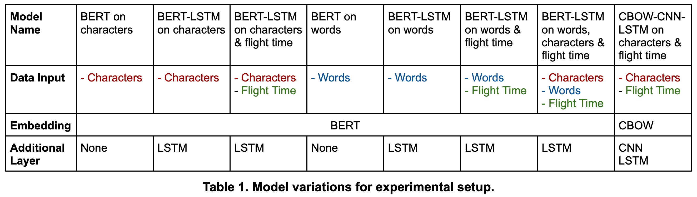
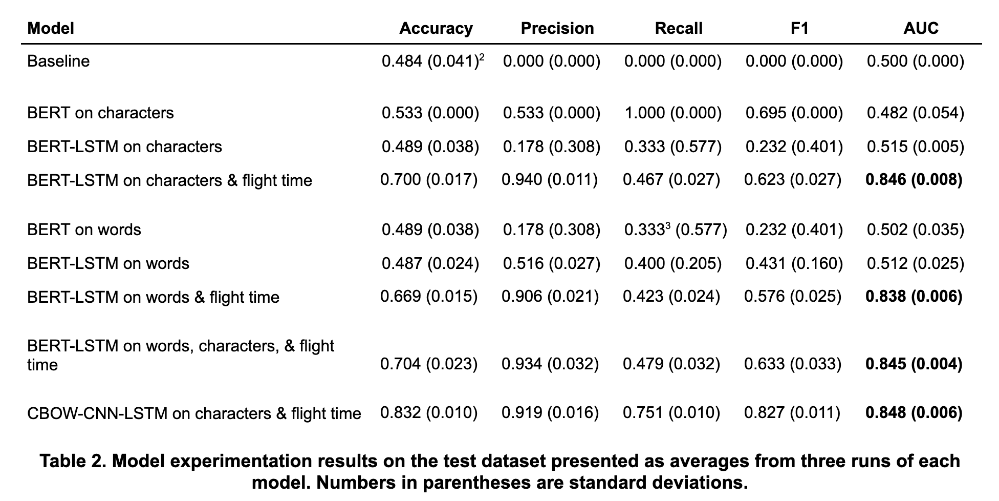
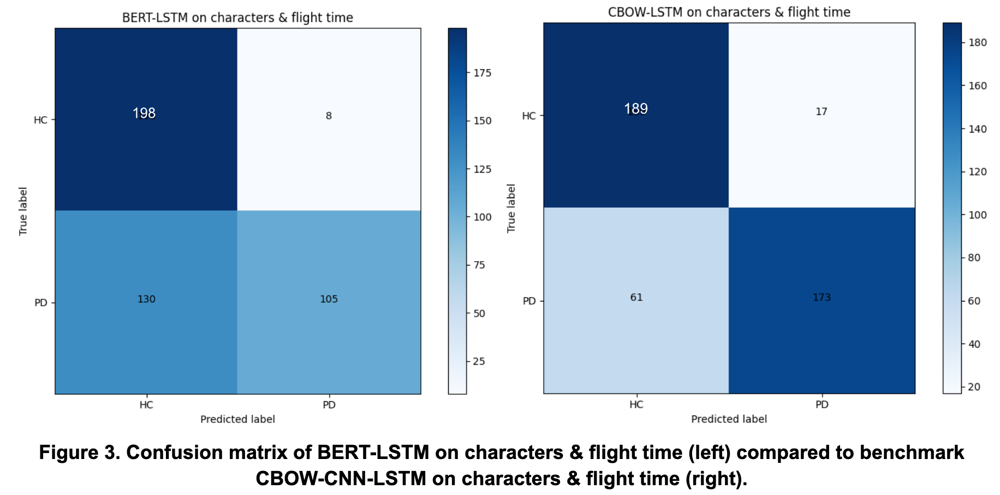

# Identifying early Parkinson's disease from Patient Typing Behavior with BERT

## Problem & Motivation
Parkinson’s Disease (PD) is a neurodegenerative illness that impairs motor function [1] and affects 10 million people globally [2]. Early detection of PD can help patients get appropriate medical care to manage symptoms and dramatically improve quality of life. There is currently a lack of widely implemented, non-invasive, and scalable means of diagnosing PD. Machine learning (ML) models based on patient speech or typing data show promise in addressing this. Speech or typing samples are relatively easy to collect from a patient and to monitor for screening purposes. We endeavor to create diagnostic ML model trained on typing data to address this gap.

## Data & ML Approach
We reached out Dhir, et al.[1] and they kindly shared their English dataset collected online with us. The PD patients were found through a recruitment service of a Parkinson’s charity and HCs were found through a participant recruitment service. The PD patients recruited were in the early disease stages. Each individual was asked to copy-type approximately 15 different sentences 10-15 words long from Wikipedia articles. We balanced the dataset to 1470 PD and 1470 healthy controls (HC) responses for experiments onward.

The main data features we implemented for our model are:
1. individual keystrokes or character-level responses; these include typos and special keys like "spacebar", "enter", and "backspace" which needed to be added to BERT's tokenzier vocabulary.
2. response content or world-level responses; these include typos but exclude special keys to consider any semantic information at the word or sub-word level.
3. flight time of key presses or the time elapsed in milliseconds between key presses

We constructed an ablation style matrix of experiments to understand what aspects of model architecture or data features had the greatest impact on modeling performance, especially in comparison to [1], who utilized one hot encoding, continuous bag-of-words (CBOW), and LSTM layers. We hypothesized a more sophisticated embedding strategy with the use of attention, as with BERT, would create more contextually rich embeddings for the model to learn from. We also experimented with various data input combinations of characters, words, and flight time.

## Key Learnings
Experimental results are summarized in Table 2 below.

 

> **BERT did not improve classification performance on copy-typed data.**

The performance of our BERT on characters and BERT on words models did not improve. The AUC values are on par with the baseline and examining the confusion matrices of each of these models showed that each model was predicting either all HC or all PD, implying that the BERT model alone is not learning any PD markers from either the character sequence or the whole words of the response content. With keystrokes, this is unsurprising as BERT is not built for character-level embeddings. We also saw poor performance from BERT on words. This may in part be driven by the nature of the data. As participants copy-typed passages, we expect no difference in semantic meaning between the words of HCs and PD patients. The signal from typos alone may have been too weak for BERT to classify based on. 

> **With this dataset, flight time had the greatest impact on model performance outside of any changes to model architecture.**

Incorporating flight time had a considerable effect on our model’s ability to learn. We can see from the resulting confusion matrices in Figure 3 that our model, BERT-LSTM on characters & flight time, is able to achieve a level of classification performance on par with a model approximately the same as [1]’s (our CBOW-CNN-LSTM on characters and flight time model) with an AUC of 0.846 and 0.848, respectively. However, our BERT-LSTM model has lower accuracy than the CBOW-CNN-LSTM model, meaning it makes fewer correct overall predictions. Our BERT-LSTM model also has lower recall and F1 scores, meaning it has a higher rate of false negatives and thus has poorer balance between precision and recall. Contrary to our expectations, this implies that using BERT and attention in our embedding strategy does not significantly improve classification performance compared to a very simple embedding method like CBOW.

> **We were able to match Dhir, et al.'s benchmark AUC with our BERT-LSTM architecture but did not achieve a new state-of-the-art result.**

Our BERT-LSTM model did not outperform Dhir, et al.'s model. To achieve new SOTA results that utilize the identity of the characters/words in typing data in addition to flight time, we suggest a different data collection approach. Free-form patient generated typing, as opposed to copy-typed data, would allow for semantic differences between PD patients and HCs. Given how PD can impact language and vocabulary [10] we believe this would provide an additional signal to distinguish PD patients from HCs. The presence of semantic differences between HCs and PD patients would maximize the potential of attention-based embedding strategies such as BERT to contribute to classification performance. 

## References
1. Neil Dhir, Mathias Edman, Álvaro Sanchez Ferro, Tom Stafford, and Colin Bannard. 2020. Identifying robust markers of Parkinson’s disease in typing behaviour using a CNN-LSTM network. In Proceedings of the 24th Conference on Computational Natural Language Learning, pages 578–595, Online. Association for Computational Linguistics.

2. Parkinson’s Foundation. Accessed 2 Oct 2023. Statistics - Get informed about Parkinson's disease with these key numbers. Online. 

3. S. Tripathi, T. Arroyo-Gallego and L. Giancardo. Keystroke-Dynamics for Parkinson's Disease Signs Detection in an At-Home Uncontrolled Population: A New Benchmark and Method, in IEEE Transactions on Biomedical Engineering, vol. 70, no. 1, pp. 182-192, Jan. 2023, doi: 10.1109/TBME.2022.3187309.

4. Nijhawan R, Kumar M, Arya S, Mendirtta N, Kumar S, Towfek SK, Khafaga DS, Alkahtani HK, Abdelhamid AA. A Novel Artificial-Intelligence-Based Approach for Classification of Parkinson’s Disease Using Complex and Large Vocal Features. Biomimetics. 2023; 8(4):351. 

5. Escobar-Grisales D, Ríos-Urrego CD, Orozco-Arroyave JR. Deep Learning and Artificial Intelligence Applied to Model Speech and Language in Parkinson’s Disease. Diagnostics. 2023; 13(13):2163.

6. Chintalapudi N, Battineni G, Hossain MA, Amenta F. Cascaded Deep Learning Frameworks in Contribution to the Detection of Parkinson's Disease. Bioengineering (Basel). 2022 Mar 12;9(3):116. doi: 10.3390/bioengineering9030116. PMID: 35324805; PMCID: PMC8945200.

7. Wentao Ma, Yiming Cui, Chenglei Si, Ting Liu, Shijin Wang, and Guoping Hu. 2020. CharBERT: Character-aware Pre-trained Language Model. In Proceedings of the 28th International Conference on Computational Linguistics, pages 39–50, Barcelona, Spain (Online). International Committee on Computational Linguistics.

8. Katsunori Yokoi, Yurie Iribe, Norihide Kitaoka, Takashi Tsuboi, Keita Hiraga, Yuki Satake, Makoto Hattori, Yasuhiro Tanaka, Maki Sato, Akihiro Hori, Masahisa Katsuno. Analysis of spontaneous speech in Parkinson's disease by natural language processing, Parkinsonism & Related Disorders, Volume 113, 2023, 105411, ISSN 1353-8020

9. Vásquez-Correa, J.C. et al. (2019). Convolutional Neural Networks and a Transfer Learning Strategy to Classify Parkinson’s Disease from Speech in Three Different Languages. In: Nyström, I., Hernández Heredia, Y., Milián Núñez, V. (eds) Progress in Pattern Recognition, Image Analysis, Computer Vision, and Applications. CIARP 2019. Lecture Notes in Computer Science(), vol 11896. Springer, Cham.

10. Pfeiffer, H. C. V., Løkkegaard, A., Zoetmulder, M., Friberg, L., & Werdelin, L. (2014). Cognitive impairment in early‐stage non‐demented Parkinson's disease patients. Acta Neurologica Scandinavica, 129(5), 307-318.

11. Soumen Roy, Utpal Roy, Devadatta Sinha, Rajat Kumar Pal. (2023). Imbalanced ensemble learning in determining Parkinson’s disease using Keystroke dynamics. In: Expert Systems with Applications, Volume 217, 2023, 119522, ISSN 0957-4174.
